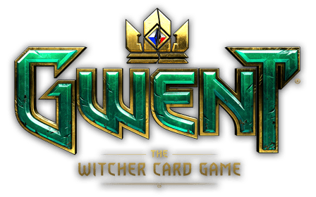

# Organo Gwent - Exercício de React.js / React.js Exercise

  
   
  
  
  

## 🔎 Overview

Aplicação desenvolvida ao longo do curso de React com JavaScript da [**Alura**](https://www.alura.com.br/). A aplicação, originalmente, é uma página de organização de times e pessoas que foi adaptada por mim ao longo do curso para organização de cartas de [Gwent](https://www.playgwent.com/pt-BR), da franquia The Witcher.

Dessa forma, o design apresentado na aplicação diverge um pouco do [design proposto pela Alura no Figma](https://www.figma.com/file/T6BLI1HfB81eYOiVgpqQz7/Projeto-Intro-ao-React). As cores utilizadas foram baseadas nas cores padrões de cada deck do jogo de Gwent. Também deixei algumas cartas pré cadastradas para melhor visualização da aplicação como um todo ao abrir a página pela primeira vez.

---

_English version_

## 🔎 Overview

Application developed during the React with JavaScript course from [**Alura**](https://www.alura.com.br/). Originally, the application is a home page for organizing people and teams, but it was adapted for organizing [Gwent](https://www.playgwent.com/pt-BR) game cards, a game from The Witcher franchise.

Thus, the design found in this application diverges a little from [the one proposed by Alura on Figma](https://www.figma.com/file/T6BLI1HfB81eYOiVgpqQz7/Projeto-Intro-ao-React). The colors I've used were inspired by the original color from each Gwent deck. I've also left some pre registered cards in each section for better visualizing the entirety of the application once opened for the first time.

---

Developed with 🧡 by [@sucodelarangela 🍊](https://angelacaldas.vercel.app)
